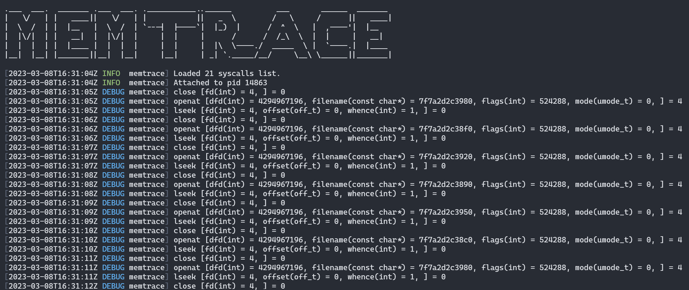

# Memtrace - trace your memory usage as a function of fd activity.

Memtrace is half-baked project idea that traces memory activity of a binary or a PID as a function of file descriptor activity.
When binaries run stuff like reading/writing off a file, they might "forget" to deallocate the memory which leaks and the process
memory grows too large. One way to check for stuff like this valgrind, but for running processes memtrace should be easier to use.

Memtrace can run a brand-new binary or attach to an existing process, read it's file descriptor table and figure out the memory
allocation/deallocation pattern of the binary/process based on fd activity. It is a frontend to linux's `ptrace` and will not work on 
Windows currently.